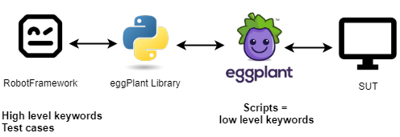

# Robot Framework eggPlant Library

This [dynamic](http://robotframework.org/robotframework/latest/RobotFrameworkUserGuide.html#different-test-library-apis)
library for [Robot Framework](https://robotframework.org/) allows calling
[eggPlant Functional](https://www.eggplantsoftware.com/eggplant-functional-downloads) scripts via XML RPC
using [eggDrive](http://docs.testplant.com/ePF/using/epf-about-eggdrive.htm).  
It considers **eggPlant scripts as low level keywords** and exposes them for usage in **high level keywords and test cases in Robot Framework**.  
So the scripts themselves have to be created in eggPlant, not in Robot Framework.

The eggPlant itself should be launched in eggDrive mode from outside -
see the scripts `start_eggPlant.bat` and `stop_eggPlant.bat` for example.



- [Quick Start](#quick-start)
- [eggPlant compatibility](#eggplant-compatibility)
- [Importing library](#importing-library)
- [Keywords](#keywords)
- [Library usage in VS Code](#library-usage-in-vs-code)
- [Running self-tests](#running-self-tests)
## Quick start

### System requirements

- Windows (Unix not tested yet)
- Python 3.9 or newer
- Robot Framework

#### Running tests requires additionally

- eggplant 21.1.0 or newer
- Valid eggplant license

Apart from test execution **you can use the eggPlant Library without eggplant and license**.  
You can still develop test cases and keywords and run tests in the
[dryrun mode](https://robotframework.org/robotframework/latest/RobotFrameworkUserGuide.html#dry-run).  
You'd need a file structure created by eggplant though -
to let the library discover your eggplant scripts and expose them as keywords.

### Installation

```shell
pip install robotframework-eggplantlibrary
```

### Test case example

```robotframework
*** Settings ***
Library   EggplantLibrary   suite=E:/eggPlantScripts/SuiteOne.suite    host=http://127.0.0.1   port=5400
# Setting path to the eggplant test suite folder during library import for discovering eggplant scripts as keywords

Suite Setup     Open Session
Suite Teardown  Close Session
Test Setup      Connect SUT    Windows_10_1

*** Test Cases ***
Test One
    Check Input In Notepad    Hello World    Some value
    # Calling an eggplant script as a keyword 
```

### Running tests

1. Start eggPlant in eggdrive mode - see the scripts `start_eggPlant.bat` and `stop_eggPlant.bat` for example
2. Launch tests with a `robot` command as usual

### Check out examples in the folder `tests`

## eggPlant compatibility

The Eggplant Library is compatible with eggPlant 21.1.0 and newer versions.  
Older eggPlant versions may work properly sometimes, but in most cases they are incompatible
and tests might either fail or pass unexpectedly.

The library checks the current eggplant version in the `Open Session` keyword and logs a warning
in case of incompatibility.

>There is **no backwards compatibility** with older versions due to significant changes in eggplant -
new lists and properties format, changed movie and screenshot commands, named params and default values etc.  
See Release Notes for eggplant [20](http://docs.eggplantsoftware.com/ePF/gettingstarted/epf-v20-release-notes.htm) und [21](http://docs.eggplantsoftware.com/ePF/gettingstarted/epf-v21-release-notes.htm) for more information.

## Importing library

Each library import is bound to a single **eggPlant test suite**, which path can be specified at library import.  
The library needs a file access to the ``.suite`` folder in order to get keywords (i.e. eggPlant ``.script`` files),
their arguments and documentation.

### Import parameters  

- ``suite``: path to the eggPlant ``.suite`` file.
  - If eggPlant runs on a remote server, input here a path from the library host, not relative to the server! And it must be reachable.  
  - The default value is a first _.suite_ file in the library folder.  
  - You can also select another eggPlant suite for actual execution using `Open Session` and `Close Session` keywords.
- ``host``: host name or IP address of the eggPlant server running in the eggDrive mode.  
  - The default value is ``http://127.0.0.1``.
  - You can also select another host name for actual execution using `Set eggDrive Connection` keyword.
  - **The library has been tested on localhost only!**
  It would be a miracle if it worked just like this with a remote eggPlant server.
- ``port``: port of the eggPlant server.
  - The default value is ``5400``.
  - You can also select another port for actual execution using `Set eggDrive Connection` keyword.
- ``scripts_dir``: folder inside the eggPlant Suite, where all scripts are located.
  - The default value is ``Scripts``.
  - Subfolders are supported.

#### Each parameter is optional and may stay unset during library import

In this case library looks for it's value in the **config file** `EggplantLib.config` in the library package dir.
If no value found in the config file (or no file exists), the default value is used.  

### Config file example

```txt
suite=..\tests\keywords\eggPlantScripts\SuiteOne.suite
scripts_dir=Scripts
host=http://127.0.0.1
port=5400
```

>The config file must be named `EggplantLib.config` and located in the library package dir (e.g. ``<python_dir>\lib\site-packages\EggplantLibrary``).  

There is no real XML RPC connection being established during the import, so it's not necessary
to start the eggPlant server before importing the library.

### Import examples

```robotframework
*** Settings ***
Library    EggplantLibrary  suite=E:/eggPlantScripts/SuiteOne.suite    host=http://127.0.0.1    port=5400
Library    EggplantLibrary  suite=E:/eggPlantScripts/SuiteOne.suite    host=http://127.0.0.1    port=5400    WITH NAME    MySUT
Library    EggplantLibrary
# Import without parameters needs 'EggplantLib.config' in the library package dir
```

## Keywords

- Each library import is bound to a single eggPlant test suite, which path can be specified at library import.  
The library needs a file access to the eggPlant .suite file in order to get keywords (i.e. eggPlant .script files), their arguments and documentation.

- The eggPlant scripts are exposed as keywords with script names (without .script extension) using standard RF format - e.g. ``HelloWorld.script`` is exposed as ``Hello World``.  

- Scripts can be structured in **subfolders**. In this case a subfolder name is added as prefix following by a dot, e.g. ``Subfolder.Myscript``.  
If there are several sufolders in the structure, all of them are added as prefix, separated by a dot, e.g. ``Subfolder.SubSubfolder.Myscript``.  

- The eggPlant scripts named with an underscore ('_') at the beginning are considered as **internal scripts** and would not be exposed as keywords to RF.

### Keyword documentation is supported

All comments at the top of a script file are fetched as a keyword documentation and appear in code completion and libdoc.
The [Robot Framework documentation formatting](http://robotframework.org/robotframework/latest/RobotFrameworkUserGuide.html#documentation-formatting) is supported:

[Tags](http://robotframework.org/robotframework/latest/RobotFrameworkUserGuide.html#keyword-tags) may be set in the last comment row [as usual](http://robotframework.org/robotframework/latest/RobotFrameworkUserGuide.html#getting-keyword-tags) in Robot Framework keyword documentation.

```sensetalk
# This is my eggPlant sctipt documentation.
// I can use single line comments 
-- with #, // and --
(* And multiline comments
Formatting supported: *bold*, _italic_, List:
- One
- Two

RobotFramewok tags are supported as well:
Tags: first, second
*)
```

### Static keywords

The library also contains several built in keywords (independent from actually available eggPlant scripts) for taking screenshots, opening and closing eggPlant sessions and connections to eggDrive and SUT.

### Creating keyword documentation

You can use _libdoc_ to build the keyword documentation file:

- Static keywords only

  ```shell
    libdoc EggplantLibrary docs_static_keywords.html
  ```

- All keywords - including eggPlant scripts and static keywords as well

  ```shell
    libdoc EggplantLibrary::../tests/keywords/eggPlantScripts/SuiteOne.suite docs_example_with_eggplant_scripts.html
  ```

### Keywords accept arguments

Use standard Robot Framework argument format:

```robotframework
MyScript    Arg1    String argument with spaces   
```

`In Robot Framework you don't need additional quotes for string arguments! Wrong: "String parameter". Right: String parameter.`

- The Library tries to convert arguments from Robot Framework data types into eggPlant data types.  
  These standard Robot Framework data types are tested snd should work: **int**, **float**, **bool**, **list**, **string**.
- List arguments are supported, including nested lists.  
  It is still possible to use old eggPlant list format as a string - the values are converted in proper lists. Example:
  
  ```robotframework
  MyScriptForListParams     ("first", "second", "third")
  ```

- [Named parameters](http://docs.eggplantsoftware.com/ePF/SenseTalk/stk-parameters-and-results.htm#named-params) and [default argument values](http://docs.eggplantsoftware.com/ePF/SenseTalk/stk-handlers.htm#default-values) are supported (support in eggplant added in 21.0.0)
  - eggPlant script example:

    ```sensetalk
    params positional_arg_no_default, arg_int:123, arg_bool:True, arg_string:"hello", arg_string_with_space:"hello world"
    ```

  - Robot Framework usage example:

    ```robotframework
    My keyword  some value
    My keyword  some value  arg_int=${456}
    My keyword  some value  arg_bool=${False}
    My keyword  some value  arg_string=Skywalker
    My keyword  some value  arg_string_with_space=I am your father
    ```

### Keywords may return values

All **eggPlant scripts** are executed using [RunWithNewResult](http://docs.testplant.com/ePF/SenseTalk/stk-script-calling.htm)
and the _ReturnValue_ of the _Result_ section from the XML RPC response is returned.  
> Due to the usage of the _RunWithNewResult_ mode the _ReturnValue_ is always a **string**.  
The Library tries to convert it to one of standard Python data types.  
These standard Robot Framework data types are tested snd should work: **int**, **float**, **bool**, **list**.

The **static (included) keywords** are different and might call an eggPlant command directly.
In this case the _Result_ section from the XML RPC response is not parsed and returned directly,
although it might be a result of a previous script.  
> No data type conversion is done in this case, as the _Result_ section is able to contain different types.

All eggPlant output is saved into the RF log file.
In case of failed execution the library takes a SUT **screenshot automatically** and embeds it into the RF log file. If **video recording** was active, it would be embedded into the log file as well.

## Library usage in VS Code

The library can be used in VS Code with the
[Robot Framework Language Server extension](https://marketplace.visualstudio.com/items?itemName=robocorp.robotframework-lsp) with most of the features supported (code completion for keywords, go to keyword source, test case run directly from VS Code etc.), but it requires some **additional setup**.

By default the Language Server Plugin for VS Code does not process import parameters of the library - i.e. all necessary initialization options can't be set in a usual way.  
You can solve it in one of the following ways:
1. Enable processing library import arguments in the [Language Server Plugin configuration](https://github.com/robocorp/robotframework-lsp/blob/master/robotframework-ls/docs/config.md)
    ```
    //put this line into 'settings.json'
    "robot.libraries.libdoc.needsArgs": ["EggplantLibrary"]
    ```
2. Alternatively you can use the [config file](#config-file-example) to specify library parameters.
    - You don't have to change the existing library import with parameters in RF test suite files -
   VS code processes the import, but ignores the parameters.
    - Direct library import parameters in RF files always have a higher pirority than config file values.
    - You may use only some of import parameters - both in RF files and in a config file.  

There is no need to reload VS Code after adding or changing eggplant script files - the Language Server extension should detect the changes and update the keyword names for code completion automatically.     
If you're having issues with it, try to regenerate the library specification files - just delete the `EggplantLibrary<...>.libspec` and `EggplantLibrary<...>.libspec.m` files in the LanguageServer specs folder - usually located somewhere in `<user_profile>/.robotframework-ls/specs/<...>/user`.


Note that importing library directly as a python file via path doesn't work for VS Code -
instead you should use module name with the correct `robot.pythonpath` in the Language Server extension settings.  
It shouldn't be a problem when installing library as a normal user,
but might be necessary for library development and maintenance.

## Running self-tests
Running self-tests ist especially useful during debugging or modifying the library.   
You need a **running eggPlant instance** to run tests - means you need an **eggplant license**.

Most of the tests don't need a real SUT connection and use a **screenshot SUT** instead.
The only tests which require a real working RDP/VNC connection have the _real_SUT_needed_ tag.   
So you can use the following command:
```
robot --exclude real_SUT_needed tests
```
 **Without valid license or eggPlant instance running** you can still run the tests in the **dryrun** mode - it allows to check the library in general and the getting keywords functionality.
